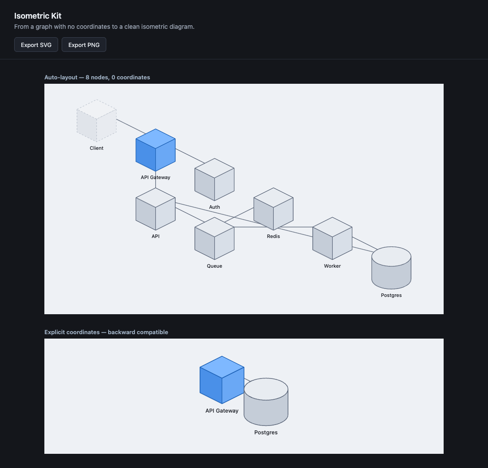

# Isometric Kit

**Describe your system as a graph. Get a high-grade isometric diagram. No coordinates required.**

Isometric Kit is a headless, deterministic engine that turns a list of nodes and links into a clean
3D-isometric architecture diagram. You give it topology; it does the layout, the projection, and the
rendering. It runs in React, in Node, or anywhere that can hold a string of SVG.

> Status: pre-release (`v0.1.0`). The layout engine and React layer are built and tested (33 passing
> tests). Packages are not yet on npm; see [Run it locally](#run-it-locally).



*Above: the input was 8 nodes and 8 links with **no coordinates**. Everything you see (ranking,
ordering, spacing, projection) was computed by the engine.*

---

## Why this exists

Architecture diagrams are stuck between three bad options:

- **Mermaid / flowcharts** are code-defined but look like 1998. Flat boxes and arrows, no spatial sense.
- **Figma / draw.io / Excalidraw** look fine but are hand-drawn, so they are stale the moment a service
  is added and impossible to generate programmatically.
- **Raw SVG from an LLM** burns thousands of tokens and breaks constantly.

Isometric Kit is the missing fourth option: **diagrams as data**. A 10-line JSON object compiles to a
diagram good enough to put in a deck, and because the input is pure topology, it is trivial for an LLM,
a `docker-compose.yml` parser, or a CI job to produce.

## The core idea: no coordinates

Most diagram-as-code tools still make you place things. Isometric Kit does not. Hand it nodes and
links with no `u`/`v` and the engine arranges them: it ranks linked nodes by dependency depth, orders
each rank to reduce crossings, spaces everything so nothing overlaps, and projects it all onto a 2:1
isometric grid.

```tsx
import { ArchitectureGraph } from '@isometric-design/react';
import '@isometric-design/react/tokens.css';

// No u/v anywhere. This is the shape an LLM or a config parser emits.
const system = {
  nodes: [
    { id: 'client',  type: 'service',  label: 'Client', theme: 'ghost' },
    { id: 'gateway', type: 'service',  label: 'API Gateway', theme: 'accent' },
    { id: 'api',     type: 'service',  label: 'API' },
    { id: 'db',      type: 'cylinder', label: 'Postgres' },
  ],
  links: [
    { from: 'client',  to: 'gateway', type: 'axial' },
    { from: 'gateway', to: 'api',     type: 'axial' },
    { from: 'api',     to: 'db',      type: 'axial' },
  ],
};

export default function Diagram() {
  return <ArchitectureGraph data={system} />;
}
```

Already have coordinates? Pass `u`/`v` on any node and they are pinned; the rest auto-place around
them. Pass them on every node and the layout is a no-op. The explicit path is fully preserved.

## Install

```bash
npm install @isometric-design/react @isometric-design/core
```

`@isometric-design/react` is the component layer; `@isometric-design/core` is the framework-agnostic
engine (use it directly for server-side or non-React rendering). React 18+ is a peer dependency.

## Usage

### React, data-driven

```tsx
import { ArchitectureGraph } from '@isometric-design/react';
import '@isometric-design/react/tokens.css';

<ArchitectureGraph data={system} />;          // auto-layout when coords are missing
<ArchitectureGraph data={system} autoLayout={false} />; // require explicit coords
```

Node types: `service` (cube), `cylinder` (datastore). Link types: `axial` (straight) and `dogleg`
(orthogonal elbow). Themes: `surface`, `accent`, `ghost`.

### Headless core (Node, SSR, LLM pipelines)

The engine has zero runtime dependencies and never touches the DOM. `layoutScene` assigns
coordinates; `buildArchitectureSvg` returns a standalone SVG string. This is the path for "AI emits
JSON on the server, you return an image":

```js
import { layoutScene, buildArchitectureSvg } from '@isometric-design/core';

const scene = layoutScene(system);            // graph -> coordinates (pure, deterministic)
const svg = buildArchitectureSvg(scene);      // coordinates -> standalone <svg> string
```

### Export to SVG / PNG

```tsx
import {
  exportArchitectureSvg,
  downloadArchitectureSvg,
  downloadArchitecturePng,
} from '@isometric-design/react';

const svg = exportArchitectureSvg(system);          // string (works coord-less too)
downloadArchitectureSvg(system, 'architecture.svg'); // browser download
await downloadArchitecturePng(system, 'architecture.png', { scale: 2 });
```

### Next.js

Works in the App Router: import `tokens.css` once in your root layout and render
`<ArchitectureGraph>` from a client component. A ready-to-run example lives in
[`examples/nextjs/`](examples/nextjs/).

## How it compares

| | Code-defined | Auto-layout | Isometric | Headless / embeddable | Open source |
|---|:---:|:---:|:---:|:---:|:---:|
| Mermaid | yes | yes | no | partial | yes |
| draw.io / Excalidraw | no | no | no | no | yes |
| CloudCraft | no | partial | yes | no | no |
| **Isometric Kit** | **yes** | **yes** | **yes** | **yes** | **yes (MIT)** |

## Roadmap

Phase 0 (the auto-layout engine above) is the shared keystone. Everything else builds on it:

- **Phase 0 - Auto-layout engine.** Graph to coordinates. **Done.**
- **Phase 1 - LLM-native renderer.** A condensed, forgiving schema and an embeddable renderer so an
  assistant can emit a tiny object and get a diagram inline.
- **Phase 2 - Config to diagram.** Parse `docker-compose.yml` / Terraform / live config into the graph
  schema, so a diagram redraws itself on every merge.
- **Phase 3 - Visual canvas.** A drag-and-drop editor that exports the exact `<ArchitectureGraph>` code.

The specs for each phase live in [`docs/specs/`](docs/specs/).

## How it works

Three layers, kept deliberately separate:

| Layer | Path | Responsibility |
|-------|------|----------------|
| Projection | `packages/core/src/iso-engine.js` | `(u, v, z)` grid to `(x, y)` screen, 2:1 isometric |
| Layout | `packages/core/src/layout/` | graph to non-overlapping coordinates (`layoutScene`) |
| Rendering | `packages/core/src/nodes/`, `vectors/` | SVG strings from projected vertices |
| React | `packages/react/src/` | declarative components over the engine |

The layout pipeline is a hand-rolled, iso-aware layered (Sugiyama-style) layout: cycle-breaking
longest-path ranking along `u`, barycenter crossing-reduction along `v`, footprint-aware spacing
verified against real node bounds, and connected-component packing. It is pure and deterministic (no
clocks, no randomness), so the same graph always yields the same diagram. That property is what makes
"redraws identically on every commit" possible.

## Run it locally

```bash
git clone <repo> && cd isometric-design
npm install
npm run dev        # React demo at http://localhost:5173
npm test           # 33 tests
```

`npm run dev:vanilla` serves the vanilla shape explorer at http://localhost:8080.

## License

MIT. See [LICENSE](LICENSE).
