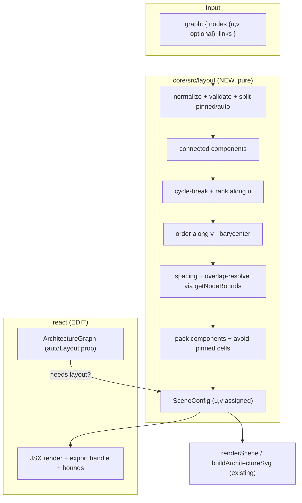

# Auto-Layout Engine — Design
**Status:** APPROVED
**Spec:** docs/specs/00-auto-layout-engine  ·  **Phase:** 0 of 4
**Date:** 2026-06-21
**Source brief:** requirements.md (this folder)
**Depends on:** none

## Overview / Approach

Add a pure function `layoutScene(graph, options) -> SceneConfig` to `@isometric-design/core` that
assigns `{u, v}` grid coordinates to nodes that omit them, then wire it into the React
`ArchitectureGraph` so omitting coordinates "just works". The chosen algorithm is a **hand-rolled
layered (Sugiyama-style) DAG layout adapted to the iso grid** (decision D2):

1. **Components** — split the graph into weakly-connected components; lay each out independently and
   pack them so their bounding boxes never overlap.
2. **Rank along `u`** — within a component, break cycles, then assign each node a rank (longest-path
   layering). Rank becomes the `u` coordinate. This is the iso-natural axis: two ranks apart on `u`
   with equal `v` is a clean axial link (matches the existing gateway demo: `u:1` → `u:3`, same `v`).
3. **Order along `v`** — within a rank, order nodes by the barycenter (mean `v` of their already-placed
   neighbors) to reduce crossings. Index within rank becomes `v`.
4. **Spacing** — scale the integer grid by a `spacing` factor and verify with `getNodeBounds` that no
   two node+label rects intersect; deterministically bump spacing until clear (bounded). Uniform scale
   provably separates any finite set of finite rects, so the loop terminates.
5. **Pinned nodes** — nodes that arrive with explicit `u` and `v` are immovable anchors; auto-placed
   nodes probe to the nearest free cell so they never land on an occupied (pinned or placed) cell.

Why this over alternatives: force-directed layout is non-deterministic (violates R0.2 and Angle 2's
"redraws identically"); pulling in `dagre`/`elkjs` breaks the zero-dependency, framework-agnostic
rule for core and is not iso-aware. A layered DAG maps cleanly onto the `(u, v)` grid and is the
standard for architecture/dependency diagrams.

The core stays plain ESM JS with hand-written `.d.ts` (existing convention). React changes are
additive: `u`/`v` become optional on the input type and a new `autoLayout` prop controls behavior.

## Architecture



Boundary: all layout math lives in core and is pure (no DOM, no mutation). React calls `layoutScene`
once (memoized) and feeds the coordinated result to the existing render path, the export handle, and
the bounds/fit-to-content path so on-screen and exported output share identical coordinates (R0.8.3).

## Components and Interfaces

### Core: `packages/core/src/layout/` (NEW)

Split into small files (each < 200 lines, per repo convention):
- `index.js` — public `layoutScene`, normalization, pinned/auto split, component packing, overlap pass.
- `rank.js` — cycle-breaking + longest-path ranking.
- `order.js` — barycenter ordering within ranks.

```js
/**
 * @typedef {Object} LayoutNode   // SceneNode with u/v OPTIONAL
 * @property {string} id
 * @property {'service'|'cylinder'|'stack'} type
 * @property {number} [u] @property {number} [v] @property {number} [z]
 * @property {number} [height] @property {number} [layers]
 * @property {object} [theme] @property {string} [label]
 *
 * @typedef {Object} LayoutGraph
 * @property {LayoutNode[]} nodes
 * @property {import('../render-scene.js').SceneLink[]} [links]
 *
 * @typedef {Object} LayoutOptions
 * @property {number} [spacing=1]        // grid step multiplier; auto-bumped to clear overlaps
 * @property {number} [componentGap=2]   // grid cells between packed components
 * @property {number} [maxSpacing=8]     // safety cap for the overlap-resolve loop
 */

/**
 * Pure. Returns a NEW SceneConfig with every node assigned integer u,v.
 * Does not mutate input. No Date/Math.random.
 * @param {LayoutGraph} graph
 * @param {LayoutOptions} [options]
 * @returns {import('../render-scene.js').SceneConfig}
 */
export function layoutScene(graph, options) { /* ... */ }
```

Internal helpers (not exported): `weaklyConnectedComponents(nodes, links)`,
`breakCyclesAndRank(component, adjacency)`, `orderWithinRanks(ranks, adjacency)`,
`resolveOverlaps(placed, spacing, options)`, `isPinned(node)` (both `u` and `v` are finite numbers),
`cellKey(u, v)`.

Barrel: add `export { layoutScene } from './layout/index.js';` to `packages/core/src/index.js`.

### React: `ArchitectureGraph` (EDIT `packages/react/src/ArchitectureGraph.tsx`)

```ts
export interface ArchitectureGraphProps
  extends Omit<ArchitectureCanvasProps, 'children' | 'nodes'> {
  data: ArchitectureGraphData;
  autoLayout?: boolean;        // default: auto-on when any node omits u or v
  exportRef?: Ref<ArchitectureExportHandle>;
}
```

Behavior:
- `const needsLayout = autoLayout ?? data.nodes.some(n => n.u === undefined || n.v === undefined);`
- `const laidOut = useMemo(() => needsLayout ? (layoutScene(data) as ArchitectureGraphData) : data, [data, needsLayout]);`
- Render nodes/links, build the export handle, and compute `toBoundsNodes` all from `laidOut` (not raw
  `data`) so render, export (R0.8.3), and fit-to-content agree.
- `validateGraphData(data)` still runs first (dup-id / dangling-link checks). When `autoLayout === false`
  and a node lacks coordinates, behavior is unchanged from today (renders at `undefined` → caller error);
  documented as caller responsibility.

`layoutScene` preserves unknown node fields (`theme: ThemeName`, `onClick`, `label`) by shallow-copying
each node and only writing `u`/`v`/`z`; so a React `GraphNode[]` round-trips with all props intact.

## Data Models

New/changed types.

| Type | Where | Change | Notes |
|---|---|---|---|
| `LayoutNode` | core `index.d.ts` (NEW) | `SceneNode` with `u?`,`v?` optional | layout input node |
| `LayoutGraph` | core `index.d.ts` (NEW) | `{ nodes: LayoutNode[]; links?: SceneLink[] }` | layout input |
| `LayoutOptions` | core `index.d.ts` (NEW) | `{ spacing?; componentGap?; maxSpacing? }` | all optional |
| `layoutScene` | core `index.d.ts` (NEW) | `(graph: LayoutGraph, options?: LayoutOptions) => SceneConfig` | pure |
| `GraphNodeRef` | react `types/graph.ts` (EDIT) | `u?: number; v?: number` now optional | enables coord-less input |
| `GraphNode` | react `types/graph.ts` (inherits) | `u`/`v` optional via `GraphNodeRef` | output of layout fills them |
| `ArchitectureGraphProps` | react `ArchitectureGraph.tsx` (EDIT) | add `autoLayout?: boolean` | |

Coordinate contract: assigned `u`/`v` are non-negative integers; `z` is preserved if present else `0`.
Output is a deep-enough copy that the input object graph is not mutated (R0.1.3).

## Error Handling

- **Duplicate node ids** → throw `Duplicate node id: <id>` (mirror `validateGraphData`; core performs
  its own check so `layoutScene` is safe when called outside React).
- **Links to unknown nodes** → skipped defensively in layout adjacency (matches `renderLink`'s
  tolerance of missing endpoints); React still throws earlier via `validateGraphData`.
- **Partial coordinates** (`u` set, `v` not, or vice-versa) → treated as **unpinned** (pinned requires
  both finite per R0.5.1); the present value is ignored and the node is auto-placed.
- **Empty graph** → returns `{ nodes: [], links }` unchanged.
- **Overlap loop hits `maxSpacing`** → return best layout reached (unique cells already guaranteed) and
  do not throw; pathological wide-label cases degrade to "spaced as far as cap allows" rather than fail.
- **Pure / no side effects** → never touches `document`, time, or randomness.

## Testing / Verification Strategy

Introduce **Vitest** (decision D5) as the repo's first test runner. Tests live in
`packages/core/test/layout.test.js`. Root script `test: "vitest run"`; `vitest` added as a root
devDependency. No config file needed for plain ESM (add minimal `vitest.config.js` only if resolution
requires it).

| Requirement | Test |
|---|---|
| R0.1 | coord-less graph → every node has integer `u`,`v`; `renderScene(out)` and `buildArchitectureSvg(out)` return non-empty strings with a `viewBox`; input object unmutated |
| R0.2 | `layoutScene(g)` deep-equals `layoutScene(g)` across two calls; key-order-shuffled input yields same coords |
| R0.3 | unique cells: `new Set(out.nodes.map(cellKey)).size === out.nodes.length`; overlap: all pairs of `getNodeBounds` rects are disjoint (incl. a long-label case) |
| R0.4 | 3-node cycle terminates and places all 3; two disconnected subgraphs occupy disjoint bounding boxes; an isolated node is placed without overlap |
| R0.5 | pinned node keeps exact input `u`,`v`; no auto node shares its cell |
| R0.6 | all-pinned input → output coords equal input; (regression) existing demo graphs unchanged |
| R0.7 | chain a→b→c gets strictly increasing `u` (rank); a→b lands on shared `v` when unconstrained |
| R0.9 | `npm test` runs the suite green |

Manual visual check (not a `tasks.md` item): run `apps/demo-react` with a coordinate-less graph and
confirm a clean, non-overlapping diagram; confirm existing explicit-coordinate demo unchanged.

## Reuse Map

| Need | Existing pattern | File |
|---|---|---|
| Footprint rects for overlap + spacing | `getNodeBounds` / `getSceneBounds` | `packages/core/src/bounds.js` |
| Projection constants/maths (if needed directly) | `IsoEngine.project`, `A/HH/H` | `packages/core/src/iso-engine.js` |
| Output shape + downstream consumer | `SceneConfig`, `renderScene`, `buildArchitectureSvg` | `packages/core/src/render-scene.js`, `export-scene.js` |
| Dup-id / dangling-link validation | `validateGraphData` | `packages/react/src/types/graph.ts` |
| Bounds-node projection from graph nodes | `toBoundsNodes` | `packages/react/src/types/graph.ts` |
| Exhaustive switch + `never` default | `renderGraphNode` | `packages/react/src/ArchitectureGraph.tsx` |
| Barrel export convention | re-export per line | `packages/core/src/index.js` |

## Risks & Mitigations

| Risk | Mitigation |
|---|---|
| Wide labels overlap same-rank neighbors despite spacing | uniform-scale overlap-resolve loop verified by `getNodeBounds` (provably separates finite rects), capped by `maxSpacing`; explicit long-label test |
| Pinned + auto mixing yields ugly layouts | correctness guaranteed (no collisions, pinned immovable); aesthetics are best-effort and documented |
| Making `u`/`v` optional breaks existing typed consumers | additive/looser change; callers still passing coords compile and behave identically; demos exercise this |
| Core has no compiler safety (plain JS) | thorough Vitest suite is the safety net; this is the spec's first tests |
| Non-determinism via Map/Set iteration | derive all output ordering from input arrays; never depend on Set/Map insertion order for coordinates |
| Algorithm complexity creep | two-level split (`rank.js`/`order.js`) + best-effort crossing reduction; not aiming for optimal, just clean |

## Files Changed Summary

| File | Change | Scope note |
|---|---|---|
| `packages/core/src/layout/index.js` | NEW | `layoutScene`, normalize, components, packing, overlap-resolve, pinned-avoidance |
| `packages/core/src/layout/rank.js` | NEW | cycle-break + longest-path ranking → `u` |
| `packages/core/src/layout/order.js` | NEW | barycenter ordering within ranks → `v` |
| `packages/core/src/index.js` | EDIT | export `layoutScene` |
| `packages/core/src/index.d.ts` | EDIT | add `LayoutNode`, `LayoutGraph`, `LayoutOptions`, `layoutScene` |
| `packages/core/test/layout.test.js` | NEW | Vitest suite (R0.1-R0.7, R0.9) |
| `packages/react/src/types/graph.ts` | EDIT | `u`/`v` optional on `GraphNodeRef` |
| `packages/react/src/ArchitectureGraph.tsx` | EDIT | `autoLayout` prop; run `layoutScene`; render/export/bounds from laid-out data |
| `package.json` (root) | EDIT | `test` script + `vitest` devDependency |
| `vitest.config.js` (root) | NEW (only if needed) | minimal ESM config |
| `docs/specs/README.md` | EDIT | flip Phase 0 design status on approval |
